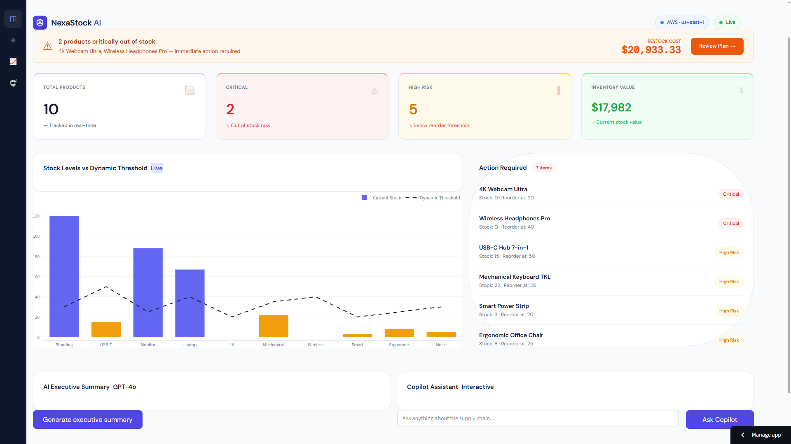

# NexaStock AI 🤖

**Serverless Supply Chain Copilot & Inventory Control Tower**


> **Live Demo →** [https://nexastock-ai.streamlit.app/]

NexaStock AI is an event-driven, AI-powered control tower that solves a critical 
business problem: supply chain disruptions and stockouts.

By leveraging real-time data and Generative AI, it identifies critical inventory 
risks and prescribes actionable purchase plans — acting as an automated warehouse manager.

---

## 🏗️ Architecture




| Layer | Technology | Purpose |
|---|---|---|
| Frontend | Streamlit Cloud | Enterprise-grade Control Tower UI |
| API | FastAPI + Mangum | Serverless REST API |
| Compute | AWS Lambda | Event-driven execution |
| Gateway | AWS API Gateway | Public HTTPS endpoint |
| Database | Amazon DynamoDB | Real-time inventory data |
| Secrets | AWS SSM Parameter Store | Encrypted API keys at runtime |
| IaC | Terraform | Declarative infrastructure |
| CI/CD | GitHub Actions + Docker | Automated Linux builds & deploys |
| AI | OpenAI GPT-4o-mini | Natural language analysis |

---

## ✨ Key Features

- **Real-time Control Tower** — Live KPIs: critical items, high-risk products, inventory value
- **AI Copilot** — Natural language queries: *"What's my exposure if supplier X delays?"*
- **Automated Purchase Plans** — AI-prescribed restocking quantities and estimated costs
- **Serverless Architecture** — Zero server management, scales to zero when idle
- **Security by Design** — IAM Least Privilege, encrypted secrets, no hardcoded keys
- **CI/CD Pipeline** — Push to `main` → Docker build → Lambda deploy in ~40 seconds

---

## 🚀 Deploy Infrastructure
```bash
cd infrastructure
terraform init
terraform plan
terraform apply
```

## 🖥️ Run Locally
```bash
# Clone and setup
git clone https://github.com/Jbaigorria22/nexastock-ia
cd ai-logistics-copilot
python -m venv venv && venv\Scripts\activate
pip install -r requirements.txt

# Configure environment
cp .env.example .env
# Add your OPENAI_API_KEY to .env

# Start backend
uvicorn src.api.main:app --reload

# Start dashboard (new terminal)
streamlit run src/dashboard/dashboard.py
```

## 📁 Project Structure
```
nexastock-ai/
├── src/
│   ├── api/          # FastAPI routes
│   ├── services/     # Business logic (AI, risk, inventory)
│   └── dashboard/    # Streamlit Control Tower
├── infrastructure/   # Terraform (Lambda, API Gateway, IAM)
├── data/             # Seed data
└── .github/
    └── workflows/    # CI/CD pipeline
```

---

Built with ❤️ by [Joaquín Baigorria](https://linkedin.com/in/joaquinbaigorria/)